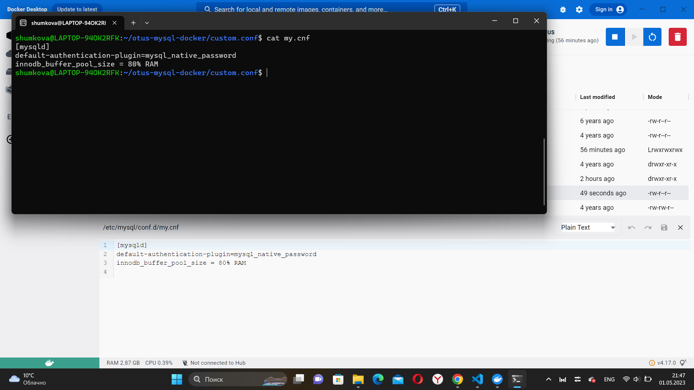
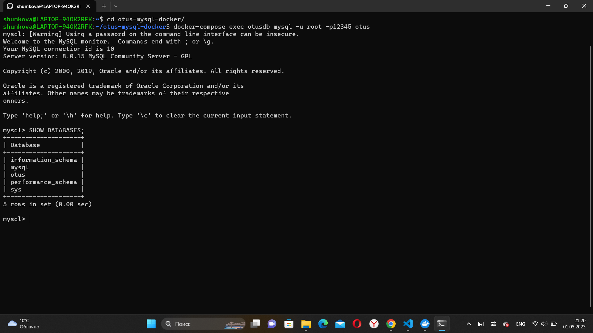

Домашнее задание
Создаем базу данных MySQL в докере

Цель:
Упаковка скриптов создания БД в контейнер

Описание/Пошаговая инструкция выполнения домашнего задания:
забрать стартовый репозиторий https://github.com/aeuge/otus-mysql-docker
прописать sql скрипт для создания своей БД в init.sql
проверить запуск и работу контейнера следую описанию в репозитории
прописать кастомный конфиг - настроить innodb_buffer_pool и другие параметры по желанию
Задание повышенной сложности*
протестить сисбенчем - результат теста приложить в README

1. забрать стартовый репозиторий https://github.com/aeuge/otus-mysql-docker

git clone https://github.com/aeuge/otus-mysql-docker

ls -la   //просмотр файлов

cd otus-mysql-docker/   //перейти в скопированный каталог

ls -la   //просмотр файлов, там должны быть custom.conf, docker-compose.yml, itit.sql

2. прописать sql скрипт для создания своей БД в init.sql

cat init.sql

CREATE database otus;

USE otus;

3. прописать кастомный конфиг - настроить innodb_buffer_pool и другие параметры по желанию

cd custom.conf/

l   //просмотро файла

cat my.cnf   //добавляем необходимые параметры

innodb_buffer_pool_size = 80% RAM

4. проверить запуск и работу контейнера

docker-compose up  //поднять docker-compose

Для подключения к БД используйте команду:

cd otus-mysql-docker/

docker-compose exec otusdb mysql -u root -p12345 otus

SHOW DATABASES;         //просмотр баз данных

